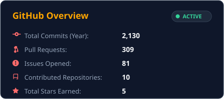
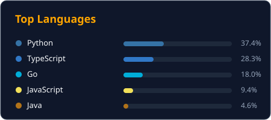
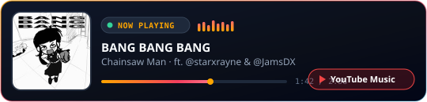

<div align="center">


[](https://github.com/danielxxomg)


</div>

---

```bash
$ cat /etc/about.conf
╔══════════════════════════════════════════════════════════════╗
║  Name       : Daniel Bello                                   ║
║  Handle     : danielxxomg                                    ║
║  Role       : Full-Stack Developer & Systems Builder         ║
║  Location   : 🇨🇴 Colombia                                   ║
║  University : UNIMINUTO — Software Development               ║
║  Focus      : Full-Stack · Offline-First IoT · Performance   ║
║  OS         : CachyOS (Arch Linux + Hyprland)                ║
╚══════════════════════════════════════════════════════════════╝
```

---

## Featured Engineering & Production Systems

<table>
<tr>
<td width="33%" valign="top">

### 🎢 Jumping Park

> **Digital Consent Platform for Commercial Kiosks**

- **Problem:** High-throughput visitor onboarding in noisy venue conditions requiring legal validation.
- **Architecture:** Kiosk-first flow, resilient OTP verification, offline-safe local queuing & reconciliation.
- **Stack:** Next.js 16 · Bun · Firebase · Zod · Playwright

[→ Live App](https://www.jumpingpark.lat/) · [→ Repo](https://github.com/danielxxomg/jumping_park_app) · [→ Case Study](https://github.com/danielxxomg/jumping_park_app/blob/main/docs/portfolio/CASE_STUDY.md)

</td>
<td width="33%" valign="top">

### 🌱 Riego Inteligente (LoteVivo)

> **Offline-First Smart Irrigation PWA**

- **Problem:** Environmental monitoring and automated irrigation under intermittent rural connectivity.
- **Architecture:** Service worker caching, local sensor telemetry buffer, ESP32/Arduino integration, push notifications.
- **Stack:** TypeScript · Next.js · React · Firebase · Arduino/IoT

[→ Live App](https://uniminuto-riego-pwa.vercel.app/) · [→ Repo](https://github.com/danielxxomg/uniminuto-riego-pwa) · [→ Case Study](https://github.com/danielxxomg/uniminuto-riego-pwa/blob/main/docs/portfolio/CASE_STUDY.md)

</td>
<td width="33%" valign="top">

###  NebulosaBot

> **Event-Driven Discord Platform & Dashboard**

- **Problem:** Scalable community moderation, economy & ticketing requiring zero event-loop lag and instant cache invalidation.
- **Architecture:** 7-layer Tach boundary enforcement, TTLCache with Supabase Realtime CDC sync, thread pooling & Next.js Server Actions.
- **Stack:** Python 3.11 · Next.js · Supabase · PostgreSQL · Tach

[→ Repo](https://github.com/danielxxomg/NebulosaBot) · [→ Architecture Docs](https://github.com/danielxxomg/NebulosaBot/tree/master/Diagramas) · [→ Specs](https://github.com/danielxxomg/NebulosaBot/tree/master/openspec)

</td>
</tr>
</table>

> ⚡ **Systems & Agentic Tooling:** Creator of [bak-cli](https://github.com/danielxxomg/bak-cli) (Linux backup utility) and [commandgate](https://github.com/danielxxomg/commandgate) (CLI security gatekeeper). Active contributor to Spec-Driven Development (SDD) and Model Context Protocol (MCP) workflows.

---

## Technical Stack & Tooling

<div align="center">

**Core Stack**


**Backend & Data**


**Systems & Workstation**


**Exploring & Architecture**


</div>

---

## Engineering Activity & Stats

<div align="center">


<br/>




</div>

---

## Now Playing

<div align="center">

<a href="https://music.youtube.com/watch?v=SJidMDWPppI&si=iK_Y6DM0wbs4o0rY">
  
</a>

</div>

---

<div align="center">

[](https://www.linkedin.com/in/daniel-sebastian-bello-188990129/)
[](https://www.instagram.com/daniel_bello_2/)
[](mailto:danielbello.dev@gmail.com)


</div>
